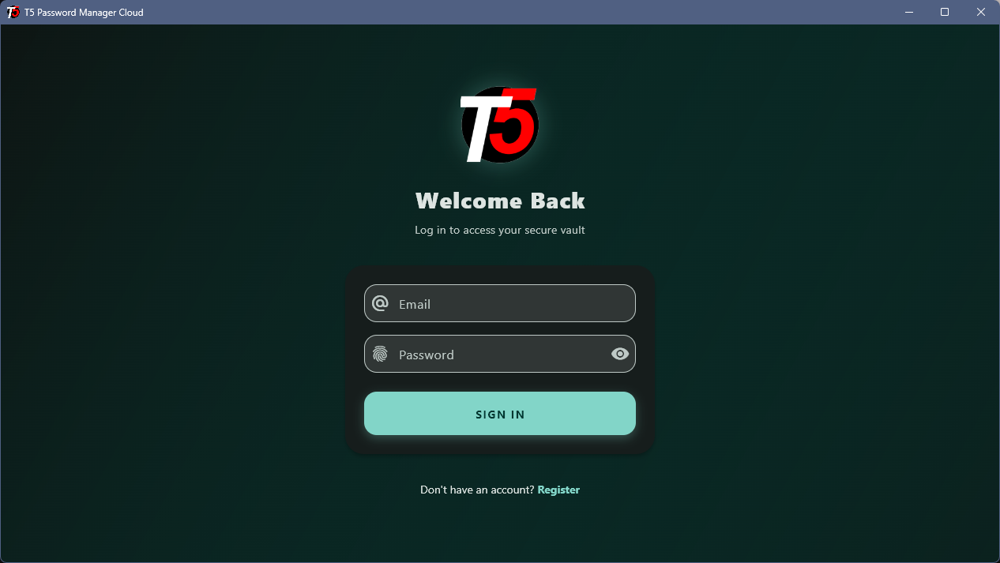
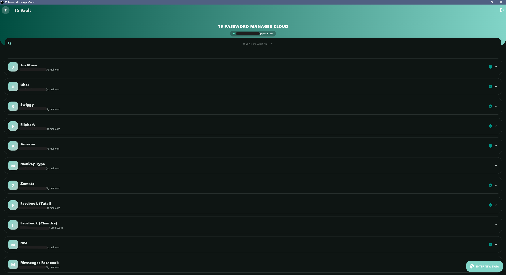
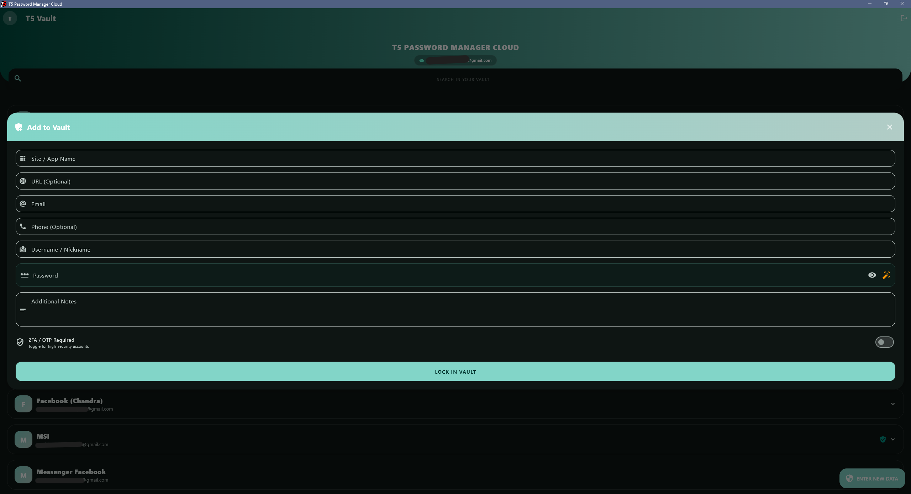
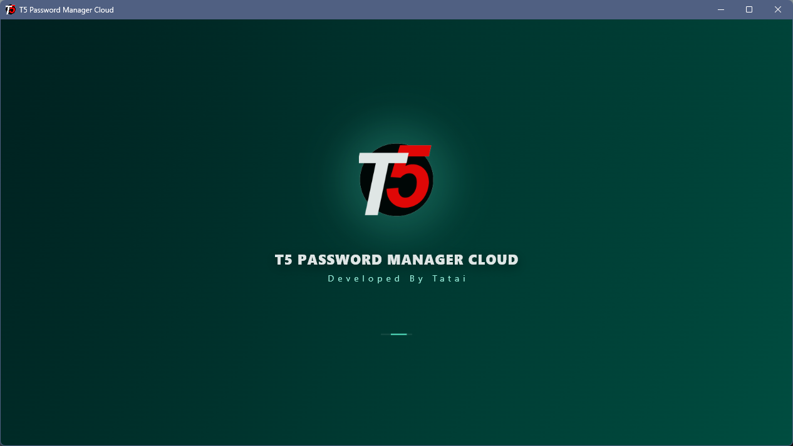
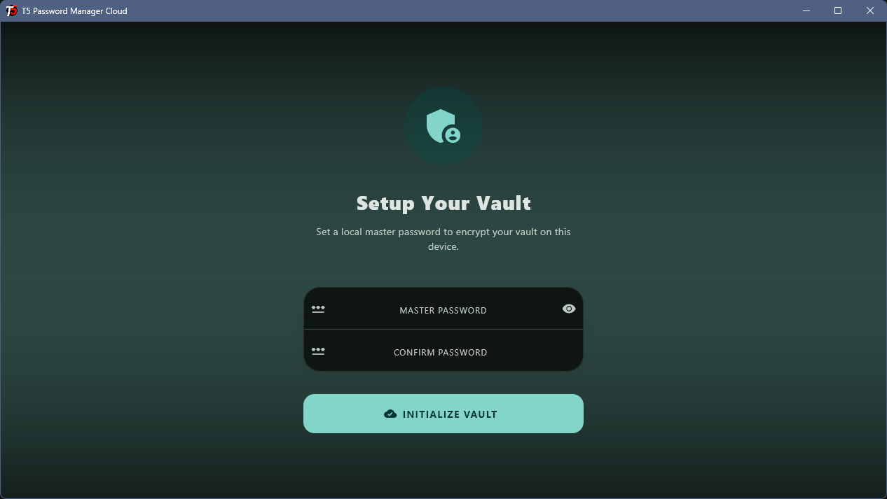
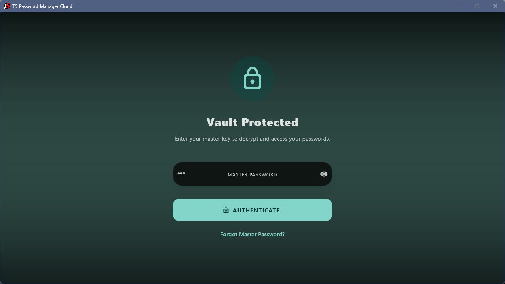
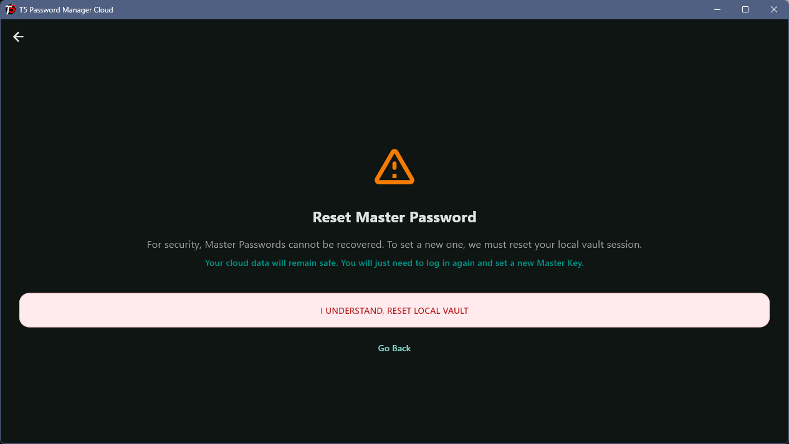

<div align="center">

  

  # T5 Password Manager - macOS 🍏

  *Secure, lightweight, and intuitive credential management for your Mac.*

  [](https://www.apple.com/macos/)
  []()
  [](https://opensource.org/licenses/MIT)
  [](http://makeapullrequest.com)

  <br><br>

  <a href="https://drive.google.com/file/d/1vVnGGUPWfyVIBRZYlO_DwsMdX_89nKQ5/view?usp=sharing">
    
  </a>

</div>

<br>

> **T5 Password Manager** brings secure and efficient credential management to your Mac. Built for performance and reliability, it ensures your sensitive data is always protected and easily accessible when you need it.

---

## ✨ Key Features

* 🔐 **Bank-Grade Encryption:** Local AES-256 encryption ensures your vault is impenetrable.
* ⚡ **Fully Safe by T5:** This app is totally maintained by T5, so your data is safe here.
* 👆 **Master Password Protection:** A single, secure key to unlock your entire vault.
* 🎲 **Smart Password Generator:** Create strong, complex, and unique passwords on the fly.
* 📴 **Offline-First Architecture:** Your data never leaves your device unless you explicitly enable sync.

---

## 📸 Screenshots

| Login Screen | Password Vault | Data Entry |
| :---: | :---: | :---: |
|  |  |  |
| Loading Screen | Create Password Vault | Vault Login |
|  |  |  | 
| Reset Vault | | |
|  | | |

---

*(Note: Just drop your images into the `images/` folder in your repository to make these appear!)*

---

## 🛠 Tech Stack

This project is built using modern desktop development practices:

* **Language:** Flutter / (Dart) 
* **UI:** Flutter
* **Architecture:** MVVM (Model-View-ViewModel)
* **Storage:** Firebase / Local Encrypted Storage
* **State Management:** Provider / Riverpod / GetX *(Update as needed)*

---

## 🚀 Getting Started

### Prerequisites
* macOS 11.0 (Big Sur) or later.
* [Xcode](https://developer.apple.com/xcode/) installed via the Mac App Store (Required for compiling Apple apps).
* [CocoaPods](https://cocoapods.org/) installed (`sudo gem install cocoapods`).
* Flutter SDK installed on your machine.

### Installation for Developers

1. **Clone the repository:**
   ```bash
   git clone [https://github.com/Tatai47/T5-Password-Manager-Cloud-For-macOS.git](https://github.com/Tatai47/T5-Password-Manager-Cloud-For-macOS.git)
